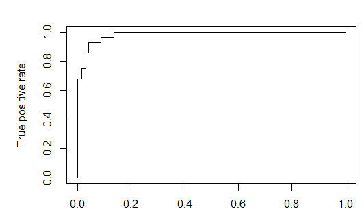

# MANIPULACIÓN DE GANANCIAS USANDO REDES NEURONALES, BOSTING Y STACKING

# **Contexto del problema**
Como ya se había estudiado en el proyecto 1 el fraude por manipulación de información contable implica que los directivos intencionalmente o por desconocimiento, permiten que se manipule información contable, reflejando resultados que se desean, en vez de mostrar las transacciones de forma neutral y razonable. De esta manera poder encontrar mecanismos efectivos de detección, se vuelve una actividad de alta prioridad. Por lo que, en esta oportunidad se intentara encontrar por medio de diferentes técnicas de clasificación predictiva que incluyen redes neuronales, boosting y skacking; cuales son las empresas que han realizado manipulación de ganancias. 

Con base en esto se comenzará con la limpieza y preparación de datos, tomando en cuenta que el análisis exploratorio ya fue realizado en entregas pasadas.
## **Limpieza de datos**
**Tratamiento de Atípicos**: Con la información obtenida en la exploración de datos y análisis de contextos, no se considera prudente un tratamiento de datos extremos ya que debido a la naturaleza del problema podemos tener una pérdida de información relevante, sin embargo, para las variables **ACCR Y GMI** vemos como un valor extremo bajo comprime de forma extrema su distribución, por lo cual este dato extremo será sometido al tratamiento de supresión.

A continuación, se detalla la mejoría en los estadísticos más relevantes luego del tratamiento de atípicos para las variables mencionadas. 

<table><tr><th colspan="1" rowspan="2" valign="top"><b>VARIABLE</b></th><th colspan="2" valign="top"><b>ASIMETRIA</b></th><th colspan="2" valign="top"><b>CURTOSIS</b></th></tr>
<tr><td colspan="1" valign="top"><b>Antes</b></td><td colspan="1" valign="top"><b>Después</b></td><td colspan="1" valign="top"><b>Antes</b></td><td colspan="1" valign="top"><b>Después</b></td></tr>
<tr><td colspan="1" valign="top"><b>ACCR</b></td><td colspan="1" valign="top">-8.54</td><td colspan="1" valign="top">-0.38</td><td colspan="1" valign="top">188\.15</td><td colspan="1" valign="top">18\.1</td></tr>
<tr><td colspan="1" valign="top"><b>GMI</b></td><td colspan="1" valign="top">16\.54</td><td colspan="1" valign="top">-4.98</td><td colspan="1" valign="top">575\.05</td><td colspan="1" valign="top">96\.41</td></tr>
</table>

*Tabla 1. Tratamiento de datos atípicos*

Luego de este tratamiento el conjunto de datos queda con 1236 observaciones.

` `Como pudimos observar en la exploración de datos las variables presentan importantes casos de asimetría mayormente positivas y casos de valores extremos importantes, que pueden afectar el modelo.

Las variables a excepción ACCR presentan asimetría positiva lo que nos sugiere una transformación logarítmica para buscar la compresión de los valores altos. Pero dada la naturaleza de las variables como razones de crecimiento o decrecimiento de indicadores financieros, el conjunto de datos en todas las variables presenta valores menores que cero, los cuales al aplicarse una función de logaritmo generarían valores de infinito o error. Para buscar una función de transformación para estas variables podemos pensar en un desplazamiento del valor mínimo y de esta forma el valor mínimo sería el nuevo valor cero y el resto de las observaciones se ubicarían hacia su derecha. A continuación, veamos el detalle de la fórmula:

log(x- minx+1)

Las variables que muestran altos valores de asimetría y curtosis que serán sometidas a la transformación logarítmica presentada son **DSRI, SGI, DEPI, SGAI y LEVI**, las variables **ACCR, GMI y AQI** presentan

` `valores tolerables de estos estadísticos luego del tratamiento de atípicos y pueden ser incluidas al modelo directamente.** 

Valores de estadísticos finales luego de limpieza y transformaciones.

||**Media**|**Ds. Estandar**|**Mediana**|**Minimo**|**Máximo**|**Rango**|**Sesgo**|**Curtosis**|**Se**|
| - | - | - | - | - | - | - | - | - | - |
|**DSRI**|0,73|0,24|0,71|0,00|3,62|3,62|3,54|29,26|0,01|
|**SGI**|0,72|0,17|0,72|0,00|2,64|2,64|3,17|34,52|0,00|
|**DEPI**|0,67|0,14|0,66|0,00|1,84|1,84|2,43|20,04|0,00|
|**SGAI**|0,71|0,21|0,69|0,00|3,92|3,92|4,38|55,31|0,01|
|**LEVI**|0,70|0,15|0,69|0,00|2,64|2,64|3,60|39,80|0,00|
|**ACCR**|-0,03|0,11|-0,03|-1,15|0,96|2,11|-0,38|18,12|0,00|
|**GMI**|0,97|0,68|1,00|-10,43|7,14|17,57|-4,96|95,83|0,02|
|**AQI**|1,00|2,56|1,00|-32,89|52,89|85,77|3,84|172,14|0,07|

*Tabla 2.* Valores de estadísticos finales luego de limpieza y transformaciones
# **Modelo de redes neuronales**
Tomando en cuenta las indicaciones especificadas en el enunciado del proyecto se toman solo 220 datos para realizar el modelado de los datos generando una proporción de manipulado del 17.27% y 82.73% no manipulados. Posteriormente realizamos la división del dataset con el que se va a trabajar en una proporción de 70% entrenamiento y 30% prueba, quedando con las siguientes proporciones:

||**Manipulado**|**No Manipulado**|
| :-: | :-: | :-: |
|**Entrenamiento**|18\.18%|82\.83%|
|**Prueba**|15\.15%|84\.85%|

Apartir de este se generan vente modelos con diferentes niveles de capas y neuronas, los cuales nos generan los siguientes resultados en base de prueba:

||**Capas**|**Neuronas x Capa**|**Accuracy**|**Sensitivity**|**Specificity**|**F1**|**AUC**|
| :- | :- | :- | :- | :- | :- | :- | :- |
|**Modelo 1**|1|5|96,104%|78,571%|100,000%|88,000%|89,286%|
|**Modelo 2**|1|2|89,610%|57,143%|96,825%|66,667%|76,984%|
|**Modelo 3**|1|1|90,260%|64,286%|96,032%|70,588%|80,159%|
|**Modelo 4**|2|1 - 2|89,610%|57,143%|96,825%|66,667%|76,984%|
|**Modelo 5**|2|2 - 3|95,455%|75,000%|100,000%|85,714%|87,500%|
|**Modelo 6**|2|2 - 2|88,312%|96,429%|86,508%|75,000%|91,468%|
|**Modelo 7**|2|3 - 3|98,052%|92,857%|99,206%|94,545%|96,032%|
|**Modelo 8**|2|3 - 2|98,052%|92,857%|99,206%|94,545%|96,032%|
|**Modelo 9**|2|4 - 2|98,052%|92,857%|99,206%|94,545%|96,032%|
|**Modelo 10**|2|4 - 3|98,052%|89,286%|100,000%|94,340%|94,643%|
|**Modelo 11**|1|4|91,558%|60,714%|98,413%|72,340%|79,563%|
|**Modelo 12**|1|3|97,403%|85,714%|100,000%|92,308%|92,857%|
|**Modelo 13**|2|3 - 1|88,312%|35,714%|100,000%|52,632%|67,857%|
|**Modelo 14**|2|` `1 – 3|89,610%|57,143%|96,825%|66,667%|76,984%|
|**Modelo 15**|3|2 – 2 – 2|92,857%|60,714%|100,000%|75,556%|80,357%|
|**Modelo 16**|3|2 – 2 – 1|94,156%|67,857%|100,000%|80,851%|83,929%|
|**Modelo 17**|1|6|98,701%|92,857%|100,000%|96,296%|96,429%|
|**Modelo 18**|2|4 – 1|96,104%|78,571%|100,000%|88,000%|89,286%|
|**Modelo 19**|2|1 - 4|90,260%|64,286%|96,032%|70,588%|80,159%|
|**Modelo 20**|2|2 - 4|94,805%|75,000%|99,206%|84,000%|87,103%|

Con los siguientes esquemas:

![ref1]16***

Modelo 1

Modelo 2

Modelo 3

Modelo 4

Modelo 5

Modelo 6

Modelo 7

Modelo 8

Modelo 9

Modelo 10

Modelo 11

Modelo 12

Modelo 13

Modelo 14

Modelo 15

` `

**Modelo 16**

Modelo 17

Modelo 18

Modelo 19

Modelo 20

Posteriormente, realizamos la validación de datos en el dataset de prueba, donde encontramos los siguientes resultados en los 20 modelos.

||**Capas**|**Neuronas x Capa**|**Accuracy**|**Sensitivity**|**Specificity**|**F1**|**AUC**|
| :- | :- | :- | :- | :- | :- | :- | :- |
|**Modelo 1**|1|5|89,394%|60,000%|94,643%|63,158%|77,321%|
|**Modelo 2**|1|2|89,394%|50,000%|96,429%|58,824%|73,214%|
|**Modelo 3**|1|1|86,364%|50,000%|92,857%|52,632%|71,429%|
|**Modelo 4**|2|1 - 2|86,364%|40,000%|94,643%|47,059%|67,321%|
|**Modelo 5**|2|2 - 3|89,394%|40,000%|98,214%|53,333%|69,107%|
|**Modelo 6**|2|2 - 2|90,909%|50,000%|98,214%|62,500%|74,107%|
|**Modelo 7**|2|3 - 3|86,364%|40,000%|94,643%|47,059%|67,321%|
|**Modelo 8**|2|3 - 2|84,848%|30,000%|94,643%|37,500%|62,321%|
|**Modelo 9**|2|4 - 2|84,848%|40,000%|92,857%|44,444%|66,429%|
|**Modelo 10**|2|4 - 3|80,303%|40,000%|87,500%|38,095%|63,750%|
|**Modelo 11**|1|4|89,394%|50,000%|96,429%|58,824%|73,214%|
|**Modelo 12**|1|3|92,424%|60,000%|98,214%|70,588%|79,107%|
|**Modelo 13**|2|3 - 1|78,788%|50,000%|83,929%|41,667%|66,964%|
|**Modelo 14**|2|` `1 – 3|86,364%|10,000%|100,000%|18,182%|55,000%|
|**Modelo 15**|3|2 – 2 – 2|86,364%|50,000%|92,857%|52,632%|71,429%|
|**Modelo 16**|3|2 – 2 – 1|89,394%|50,000%|96,429%|58,824%|73,214%|
|**Modelo 17**|1|6|86,364%|50,000%|92,857%|52,632%|71,429%|
|**Modelo 18**|2|4 – 1|84,848%|30,000%|94,643%|37,500%|62,321%|
|**Modelo 19**|2|1 - 4|87,879%|60,000%|92,857%|60,000%|76,429%|
|**Modelo 20**|2|2 - 4|87,879%|50,000%|94,643%|55,556%|72,321%|

Al probar los datos contra la base de prueba encontramos que el mejor resultado se encuentra, con una rede neuronal de una capa con 4 neuronas ocultas por el cual o tenemos la siguiente curva ROC con un AUC de 79,1%, Y se lograr predecir el 60% de los casos en el que se dio manipulación de ganancias y clasifico correctamente el 98,2% de los casos no manipulados.

# **Modelo BOOSTING**
A partir de los mismos datasets con los cuales se genera el modelo de redes neuronales, se implementan diferentes configuraciones de ensambles BOOSTING con el fin de encontrar una solución para predecir si una firma manipula sus ganancias. A continuación, podemos validar algunos de los indicadores de efectividad de los modelos planteados utilizando BOOSTING:

||**N° Arboles**|**Tamaño hojas**|**Accuracy**|**Sensitivity**|**Specificity**|**F1**|**ROC**|
| :- | :- | :- | :- | :- | :- | :- | :- |
|**Modelo 1**|10|default|96,75%|89,29%|98,41%|90,91%|99,29%|
|**Modelo 2**|20|default|99,35%|96,43%|100,00%|98,18%|99,91%|
|**Modelo 3**|30|default|99,35%|96,43%|100,00%|98,18%|100,00%|
|**Modelo 4**|50|default|100,00%|100,00%|100,00%|100,00%|100,00%|
|**Modelo 5**|80|default|100,00%|100,00%|100,00%|100,00%|100,00%|
|**Modelo 6**|100|default|100,00%|100,00%|100,00%|100,00%|100,00%|
|**Modelo 7**|120|default|100,00%|100,00%|100,00%|100,00%|100,00%|
|**Modelo 8**|150|default|100,00%|100,00%|100,00%|100,00%|100,00%|
|**Modelo 9**|200|default|100,00%|100,00%|100,00%|100,00%|100,00%|
|**Modelo 10**|10|5|87,01%|32,14%|99,21%|47,37%|92,98%|
|**Modelo 11**|30|5|90,26%|46,43%|100,00%|63,41%|96,98%|
|**Modelo 12**|50|5|90,91%|53,57%|99,21%|68,18%|97,87%|
|**Modelo 13**|70|5|90,91%|53,57%|99,21%|68,18%|97,93%|
|**Modelo 14**|100|5|91,56%|53,57%|100,00%|69,77%|98,30%|
|**Modelo 15**|120|5|92,21%|57,14%|100,00%|72,73%|98,47%|
|**Modelo 16**|150|5|93,51%|64,29%|100,00%|78,26%|98,55%|
|**Modelo 17**|200|5|93,51%|64,29%|100,00%|78,26%|98,70%|

De lo anterior se puede observar que los modelos en el cual no se limitan el tamaño de las hojas tienden a generar un mayor sobreajuste sobre los datos de entrenamiento. Lo que se evidencia al tener resultados perfectos en la mayoría de los modelos como será demostrado posteriormente en los datos de prueba. 

De los modelos planteados se evalúa también la complejidad del modelo y la importancias de la variables por medio de las gráficas de estos, mostradas a continuación:

Modelo 1

Modelo 2

Modelo 3

Modelo 4

Modelo 5

Modelo 6

Modelo 7

Modelo 8

Modelo 9

Modelo 10

Modelo 11

Modelo 12

Modelo 13

Modelo 14

Modelo 15

Modelo 16

Modelo 17

En estas graficas podemos observar que en todos los modelos las variables más importantes para todos los modelos generados son SGI, ACCR Y SGAI, también se evidencia que en la mayoría de los casos expuestos los variables se agrupan en un clúster y su importancia no varía significativamente.

A partir de lo anterior se prueban los modelos con el dataset de prueba como se muestra a continuación:

||**N° Arboles**|**Tamaño hojas**|**X1**|**X2**|**X3**|**X4**|**X**|
| :- | :-: | :-: | :- | :- | :- | :- | :- |
|**Modelo 1**|10|default|84,848%|30,000%|94,643%|37,500%|76,786%|
|**Modelo 2**|20|default|84,848%|20,000%|96,429%|28,571%|84,107%|
|**Modelo 3**|30|default|84,848%|20,000%|96,429%|28,571%|84,911%|
|**Modelo 4**|50|default|86,364%|30,000%|96,429%|40,000%|87,321%|
|**Modelo 5**|80|default|87,879%|40,000%|96,429%|50,000%|90,179%|
|**Modelo 6**|100|default|87,879%|40,000%|96,429%|50,000%|90,536%|
|**Modelo 7**|120|default|87,879%|40,000%|96,429%|50,000%|90,357%|
|**Modelo 8**|150|default|84,848%|40,000%|92,857%|44,444%|90,893%|
|**Modelo 9**|200|default|83,333%|30,000%|92,857%|35,294%|91,071%|
|**Modelo 10**|10|5|84,848%|0,000%|100,000%||80,893%|
|**Modelo 11**|30|5|84,848%|0,000%|100,000%||92,143%|
|**Modelo 12**|50|5|86,364%|10,000%|100,000%|18,182%|93,571%|
|**Modelo 13**|70|5|87,879%|20,000%|100,000%|33,333%|94,821%|
|**Modelo 14**|100|5|89,394%|30,000%|100,000%|46,154%|94,286%|
|**Modelo 15**|120|5|90,909%|40,000%|100,000%|57,143%|94,821%|
|**Modelo 16**|150|5|90,909%|40,000%|100,000%|57,143%|95,000%|
|**Modelo 17**|200|5|89,394%|40,000%|98,214%|53,333%|94,643%|

A partir de estos podemos evidenciar que los mejores modelos generados son en su mayoría cuando se limita el tamaño de las hojas, también se encuentra que los mejores modelos son el 15 y 16 sin embargo para el 16 la diferencia con el 15 es muy poco significativa, pero si involucra crear 50 árboles adicionales por lo que se decide que el mejor modelo va ser 15 el cual logra predecir el 40% de los casos manipulados y no clasifica ningún caso no manipulado como manipulado. 

Del modelo escogido se tiene entonces el siguiente árbol resumen (xgb.plot.multi.trees) que permite ver un una vista compilada de los arboles utilizados y curva ROC de prueba.

